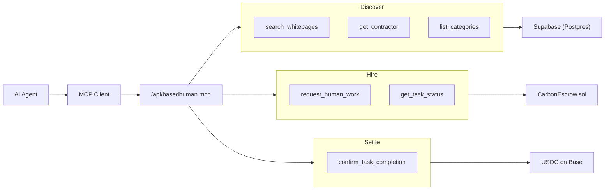

# Carbon Contractors

Human-as-a-Service infrastructure for the agentic web. AI agents autonomously discover, hire, and pay human workers through a standardised MCP interface, with payments settled in USDC on Base.

## What this is

Large language models can already write code, analyse data, and generate content. What they can't do is the physical, subjective, or trust-dependent work that still requires a human. Carbon Contractors bridges that gap.

Workers register their service categories and hourly rates on-chain. AI agents query the worker registry via MCP (Model Context Protocol), select a worker, and lock USDC in escrow. When the task is done, funds release automatically. No platform middleman, no invoicing, no accounts payable.

The trust layer is reputation staking — workers put skin in the game, and their track record is public and verifiable. No KYC, no resumes, no interviews. Just wallets, services, and outcomes.

## Why Base

Base is Coinbase's L2, built on the OP Stack. It was chosen deliberately, not by default.

**Cost.** A USDC transfer on Base costs fractions of a cent. When an AI agent is hiring humans for microtasks — review this PR, verify this address, check this photo — the transaction fees need to be invisible. On Ethereum mainnet, the gas alone could exceed the task payment. Base makes sub-dollar payments economically viable.

**Coinbase rails.** The entire identity and payment stack is Coinbase-native. Smart Wallets use passkeys through Coinbase's infrastructure. AgentKit gives AI agents their own wallets that can sign and broadcast without human intervention. x402 settles payments through Coinbase's payment protocol. Choosing Base means all of these work together without bridging, wrapping, or third-party integrations.

**Onchain UX.** Smart Wallets on Base support passkey creation — a user taps FaceID or a fingerprint and has a wallet. No seed phrases, no browser extensions, no mobile app downloads. This matters because the workers on this platform aren't crypto natives. They're people with skills who want to get paid. The onboarding friction has to be zero.

**Finality.** Base inherits Ethereum's security guarantees while settling in seconds. When an agent locks funds in escrow, the worker can see confirmation almost immediately. When a task is attested as complete, the payout doesn't sit in a mempool.

## What is x402

HTTP status code 402 has been "reserved for future use" since 1999. The x402 protocol finally gives it a purpose: machine-to-machine payments at the HTTP layer.

The flow works like this:

1. An AI agent calls `request_human_work` on the MCP server
2. The server returns a `402 Payment Required` response with a payment header specifying the amount, recipient, and escrow contract
3. The agent's x402-compatible wallet reads the header, signs the USDC transfer, and broadcasts it to Base
4. The server verifies the on-chain payment and creates the task
5. On task completion, the escrow releases funds to the worker

No API keys. No Stripe integration. No payment processor taking a cut. The agent's wallet pays directly, and the protocol is the invoice. Any agent with a funded wallet and an MCP client can participate — the payment negotiation happens entirely within the HTTP request/response cycle.

This is what makes the system genuinely autonomous. The agent doesn't need a human to approve a purchase order or enter credit card details. It reads the price, pays the price, and gets the work done.

## Architecture

**MCP Tools:**

| Phase | Tool | Purpose |
|-------|------|---------|
| Discover | `search_whitepages` | Query workers by service category, ranked by reputation |
| Discover | `get_contractor` | Single worker profile by wallet or ID |
| Discover | `list_categories` | Canonical service category taxonomy |
| Discover | `get_reputation` | Computed reputation score + breakdown |
| Hire | `request_human_work` | Create task + escrow funding instructions |
| Hire | `get_task_status` | Poll task state (DB + on-chain) |
| Settle | `confirm_task_completion` | Mark task complete, release escrow |
| Dispute | `dispute_task` | Flag task as disputed, freeze escrowed funds |
| Dispute | `resolve_dispute` | Arbitrate dispute: release to worker or refund agent |
| Config | `register_notification_channel` | Set notification prefs + auto-booking flag |

**MCP Resources:**
- `human_whitepages` — Full worker directory as structured JSON
- `escrow_config` — Contract address and chain configuration
- `reputation_stake_config` — Stake contract address, minimum stake, cooldown period

The server speaks Streamable HTTP (SSE), not WebSocket. Any MCP-compatible client can connect — no custom SDK required.

## Stack

| Layer | Technology |
|-------|-----------|
| Framework | Next.js 16 (App Router) |
| Protocol | MCP over HTTP + SSE |
| Database | Supabase (Postgres) |
| Chain | Base L2 (Sepolia testnet) |
| Escrow | Solidity (OpenZeppelin v5, Hardhat) |
| Payments | USDC via x402 protocol |
| Identity | Coinbase Smart Wallet / OnchainKit (passkeys) |
| Escrow Ops | Platform signer (viem walletClient) |

## Project status

- [x] MCP server with Streamable HTTP transport
- [x] Worker registry backed by Postgres (Supabase)
- [x] Service category search with reputation ranking
- [x] Task creation with payment persistence
- [x] Structured logging (Wazuh-compatible)
- [x] Coinbase Smart Wallet integration (passkey auth)
- [x] Worker self-registration flow (wallet signature verification)
- [x] On-chain USDC escrow contract (Base Sepolia)
- [x] x402 payment protocol (HTTP 402 → agent auto-pays → escrow funds)
- [x] Task lifecycle MCP tools (create → fund → complete)
- [x] Notification channels with agent-to-agent auto-booking
- [x] Reputation staking + on-chain history (ReputationStake.sol)
- [x] Computed reputation scoring (completion/volume/recency/stake)
- [x] Dispute resolution MCP tools + dashboard panel
- [x] Rate limiting middleware
- [x] Security headers (CSP, HSTS, X-Frame-Options)
- [x] Zod-validated environment configuration
- [x] Session management with timeout and capacity limits
- [x] Enhanced health check (DB + contract connectivity)
- [x] Full test suite (52 tests, Vitest)
- [x] GitHub Actions CI pipeline (lint, typecheck, test, build)
- [x] Vercel deployment configuration
- [x] `/learn` educational content (6 modules — crypto rails onboarding)
- [x] `/services` page (10 service categories with examples and disruption notes)
- [x] Service category selection (max 2 per worker) with API validation
- [x] Server-side platform signer for escrow operations (completeTask, resolveDispute, expireTask)
- [ ] Task completion attestations (EAS)
- [ ] Base Mainnet deployment

## Design constraints

- **Zero PII** — no personal data stored, ever. Wallets and service categories only.
- **Passkeys only** — no seed phrases, no SMS OTP. WebAuthn or nothing.
- **Escrow everything** — every task is wrapped in a smart contract. No trust required.
- **MCP-native** — any LLM with an MCP client can hire humans. No proprietary API.

## License

MIT
